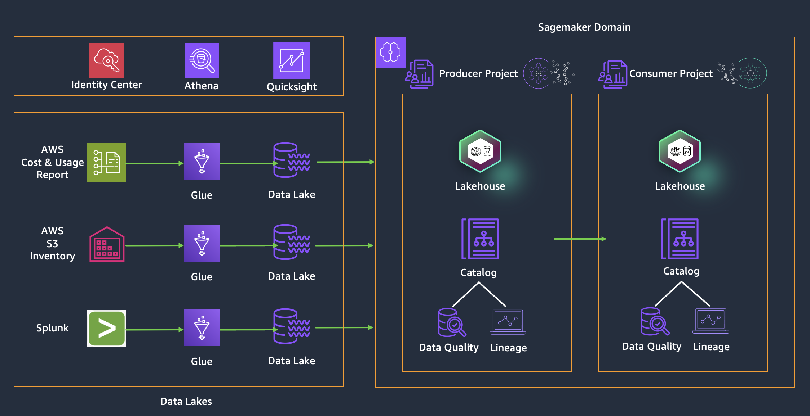
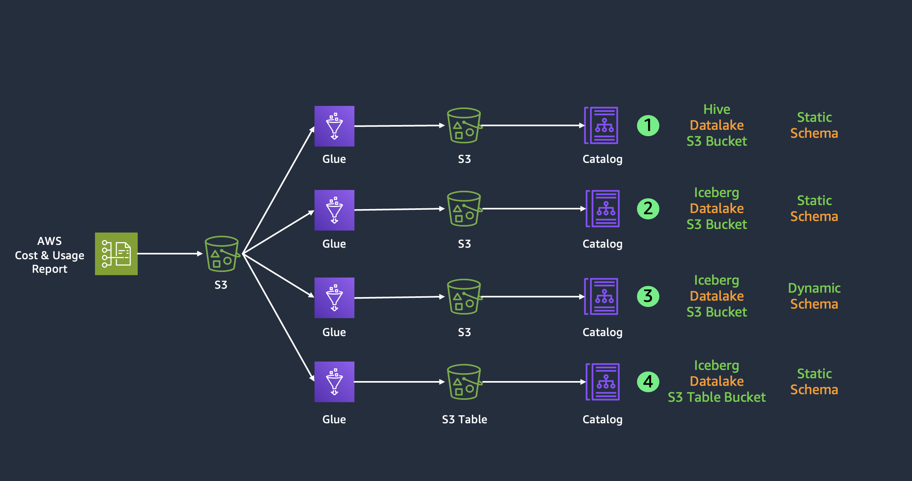
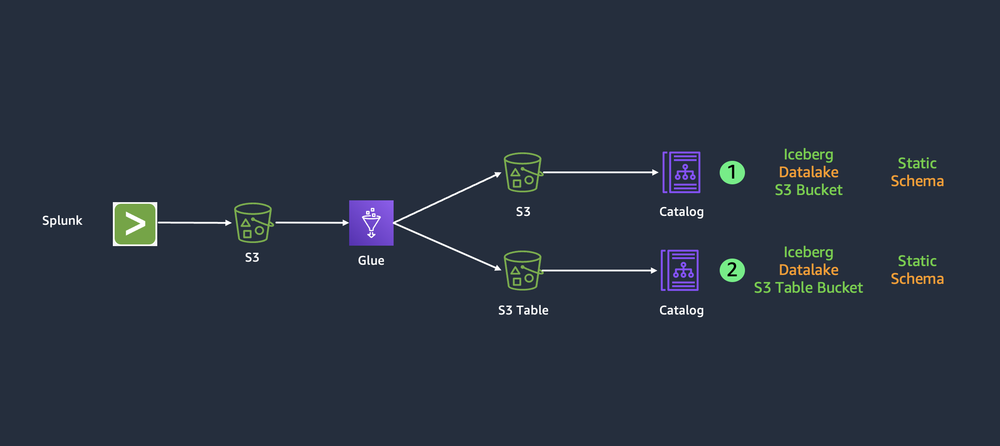

# **NEXUS** : *A Reference Solution for Data, Analytics, ML, AI & GenAI on AWS*

> [!NOTE]
> This repository is maintained by AWS FSI PACE team. While it has been thoroughly tested internally there might be things that we still need to polish. If you encounter any problems with the deployment process please open a GitHub Issue in this repository detailing your problems and our team will address them as soon as possible.

## Table of Contents
- [About Nexus](#about-nexus)
    - [Solution Vision](#solution-vision)
    - [Solution Architecture](#solution-architecture)
    - [Solution Components](#solution-components)
- [Management Data Lake for Cost Analytics](#management-data-lake-for-cost-analytics)
    - [High Level Architecture](#high-level-architecture)
- [Deploying Nexus](./docs/main/solutions-deployment.md)
- [Exploring Nexus](./docs/demo/exploring-nexus.md)
- [Security Recommendatioms](./docs/main/security-recommendations.md)
- [Contributors](#contributors)

## About Nexus

Nexus is a reference solution for developing data, analytics, ML, AI & GenAI applications using "**Iceberg**" and the "**Sagemaker Next Generation**" platform. The goal of the Nexus solution is to provide engineers with sample infrastructure-as-code modules and application modules to build their enterprise data platform on AWS. The solution is being developed working backward from customer priorities. The solution currently supports the first 5 modules marked in green (and Glue Batch data pipeline) in the solution roadmap below. 

### Solution Vision

### Solution Architecture

### Solution Components

#### Data Lakes

The solution supports modules to provision 1) Hive data lakes on standard S3 buckets 2) Iceberg data lakes on standard S3 buckets and 3) Iceberg data lakes on S3 table buckets. In addition,it covers how customers can implement 1) transaction data lakes 2) schema evolution and 3) time travel queries on Iceberg data lakes. 

#### Data Pipelines

The solution plans to support 1) batch data pipelines using Glue 2) streaming data pipeline using Glue and 3) streaming data pipeline using Flink. The initial release supports modules to provision batch data pipelines using Glue.  

#### IAM Identity Center

The solutions supports modules to provision IAM Identity Center instances, at organization-level or account-level, create users and groups and grant them required permissions.  

#### Sagemaker Unified Studio

The solutions supports modules to provision Sagemaker domains and Sagemaker projects, with integration with IAM Identity Center to support various Sagemaker domain/project roles. It provisions one domain and creates two projects, producer and consumer. 

#### Sagemaker Lakehouse

The solutions supports modules to configure Sagemaker projects to load data lakes into  Sagemaker Lakehouse. 

#### Sagemaker Data Processing

The solutions demonstrates how to implement data processing using Athena, Redshift and EMR. 

#### Sagemaker Catalog

The solutions supports modules to configure Sagemaker projects to create data sources and load assets from data lakes, view data quality and data lineage. It also supports modules to create custom assets and custom lineage.  

#### Sagemaker Data Mesh

The solutions demonstrates how to implement a data mesh solution between a producer and consumer projects with proper data governance enforced by the producer project. 

#### Sagemaker Quicksight

The solutions demonstrates how to create visualization using Quicksight leveraging data from data lakes. 

Note: Additional reading about Nexus architecture and Design principles [here](./docs/main/design-principles.md).

## Management Data Lake for Cost Analytics

Working backward from the needs of a customer, the solution implements a sample management data lake for cost analytics to demonstrate how to create Hive and Iceberg data lakes on S3 buckets and S3 table buckets, and how to implement batch data pipelines using Glue. 

### High level architecture

### Data Lakes

All three data pipelines below receive data from different data sources and store them in Hive and Iceberg data lakes using standard S3 buckets or S3 table bucket.

#### 1. AWS Cost and Usage Data Lake

The solution uses a Glue batch data pipeline to load AWS Cost and Usage report to Hive and Iceberg data lakes.

#### 2. AWS S3 Inventory Data Lake

The solution uses a Glue batch data pipeline to load AWS S3 Inventory report to Hive and Iceberg data lakes.

#### 3. Splunk Data Lake

The solution uses a Glue batch data pipeline to load operational data from a Splunk instance into Iceberg data lakes.

## Next Steps

- [Deploying Nexus](./docs/main/solutions-deployment.md)
- [Exploring Nexus](./docs/demo/exploring-nexus.md)
- [Security Recommendatioms](./docs/main/security-recommendations.md)
- Additional Resources: 
  - [About Amazon SageMaker Unified Studio](./docs/amazon-sagemaker-unified-studio.md)
  - [About Amazon SageMaker Unified Studio Lakehouse](./docs/amazon-sagemaker-unified-studio-lakehouse.md)

## Contributors

- Bikash Behera 
- Rams Sundaram 
- Yong Zhang 
- Max Tybar 
- Noah Coffin
- Vivian Bui
- Lionel Pulickal
- Marine Haddad
- Kshitija Nandkishor Dound

