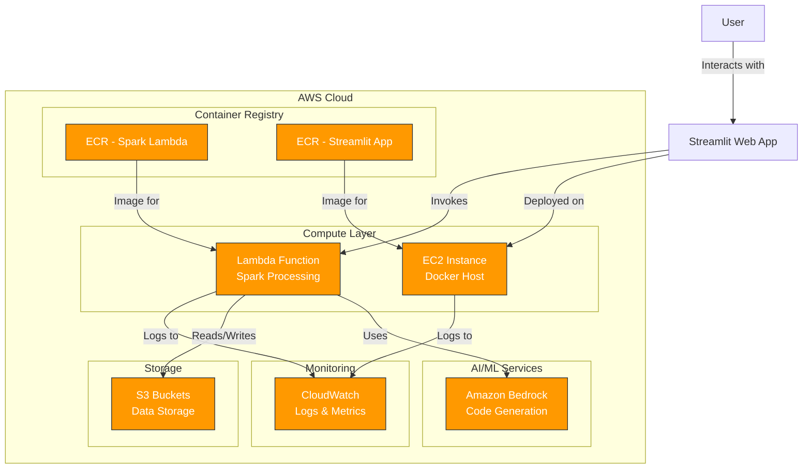

# Spark Code Interpreter


## Introduction

The Spark Code Interpreter is a conversational Gen AI solution that analyzes datasets from megabytes to petabytes using Amazon Bedrock Agents and Apache Spark. This module deploys the infrastructure required to run the Spark Code Interpreter on AWS, including containerized Lambda functions for Spark processing and an EC2-hosted Streamlit application for the user interface.

### Key Features

- **Dual Execution Options**: 
  - Spark on AWS Lambda (SoAL) for datasets up to 500MB
  
- **Containerized Deployment**:
  - Lambda function using container image for Spark processing
  - Streamlit application running as a Docker container on EC2
  
- **Conversational Interface**:
  - Natural language queries powered by Amazon Bedrock
  - Interactive data visualization through Streamlit
  
- **Scalable Architecture**:
  - Serverless-first approach for cost efficiency
  - Containerized components for consistent deployment

This module handles the complete infrastructure deployment including ECR repositories, Docker image building and pushing, Lambda function configuration, EC2 instance provisioning, IAM roles, security groups, and monitoring setup.

## Quick Start

### Using Make Targets (Recommended)

```hcl
# Edit APP_NAME, ENV_NAME, AWS_PRIMARY_REGION, etc.
APP                  = "daivi"
ENV                  = "dev"
AWS_PRIMARY_REGION   = "us-east-1"
AWS_SECONDARY_REGION = "us-west-2"
```

```bash
# 2. Deploy the infrastructure and dependencies
make deploy-spark-code-interperter
```

Full deployment steps follow [Deployment Guide](#deployment-steps)

### High-Level Architecture



The architecture consists of the following key components:

1. **User Interface**: A Streamlit web application that provides a conversational interface for users to interact with their data
2. **Compute Layer**: 
   - EC2 instance hosting the Streamlit application as a Docker container
   - Lambda function running Spark for data processing (for datasets up to 500MB)
3. **Container Registry**: ECR repositories for storing and versioning Docker images
4. **AI/ML Services**: Amazon Bedrock for generating Spark code from natural language queries
5. **Storage**: S3 buckets for storing input and output data
6. **Monitoring**: CloudWatch for logs, metrics, and alerts

## Components

### Core Components

#### 1. Spark Lambda Handler

The Spark Lambda Handler is a containerized AWS Lambda function that executes Apache Spark code generated by Amazon Bedrock. Key features include:

- **Container-based Lambda**: Packaged as a Docker container with Spark runtime
- **Memory Configuration**: 3008 MB memory allocation for Spark processing
- **Timeout**:15-minute maximum execution time
- **Data Processing**: Supports datasets up to 500MB in size
- **Integration**: Connects with Amazon Bedrock for code generation and S3 for data storage

#### 2. Streamlit Application

The Streamlit Application provides a web-based conversational interface for users to interact with the Spark Code Interpreter. Key features include:

- **Containerized Deployment**: Runs as a Docker container on EC2
- **User Interface**: Interactive web interface accessible on port 8501
- **Natural Language Processing**: Converts user queries to Spark code via Bedrock
- **Visualization**: Displays query results with interactive charts and tables
- **Auto-restart**: Container configured with restart policies for high availability

### Infrastructure Components

#### 1. ECR Repositories

Two Amazon ECR repositories are created to store and manage Docker images:

- **Spark Lambda Repository**: Stores the Spark Lambda handler container image
- **Streamlit Repository**: Stores the Streamlit application container image
- **Lifecycle Policies**: 30-day retention for untagged images
- **Security**: Image vulnerability scanning enabled

#### 2. IAM Roles and Policies

The module creates and configures IAM roles with appropriate permissions:

- **Lambda Execution Role**: Permissions for S3, Bedrock, CloudWatch, and ECR
- **EC2 Instance Role**: Permissions for ECR access, S3, CloudWatch, and SSM
- **Least Privilege**: Follows the principle of least privilege for all roles

#### 3. Security Groups

Security groups control network access to and from the components:

- **Lambda Security Group**: Allows outbound internet access for API calls
- **EC2 Security Group**: Allows inbound HTTP traffic on port 8501 and outbound access to AWS services
- **VPC Integration**: Uses existing VPC configuration from foundation modules

#### 4. Monitoring and Logging

Comprehensive monitoring and logging are configured for all components:

- **CloudWatch Logs**: Captures Lambda execution logs and EC2 application logs
- **CloudWatch Metrics**: Tracks performance metrics for Lambda and EC2
- **Alarms**: Configurable alarms for critical failures
- **Log Retention**: Configurable log retention periods for cost optimization## P
rerequisites

Before deploying the Spark Code Interpreter, ensure you have the following prerequisites:

### AWS Account and Permissions

- An AWS account with administrative permissions
- IAM permissions for:
  - ECR repository creation and management
  - Lambda function creation and management
  - EC2 instance creation and management
  - IAM role and policy management
  - CloudWatch logs and metrics access
  - S3 bucket access

### Required Tools

- **Terraform** (version >= 1.0.0)
- **AWS CLI** (version >= 2.0.0)
- **Docker** (version >= 20.10.0)
- **Docker Buildx** for multi-platform image building

## Deployment Guide

### Configuration Parameters

The Spark Code Interpreter module uses the following configuration parameters:

| Parameter | Description | Default Value | Required |
|-----------|-------------|---------------|----------|
| `APP` | Application name used for resource naming | - | Yes |
| `ENV` | Environment name (dev, test, prod) | - | Yes |
| `AWS_PRIMARY_REGION` | Primary AWS region for deployment | - | Yes |
| `AWS_SECONDARY_REGION` | Secondary AWS region for deployment | - | Yes |

These parameters can be configured in the following ways:

1. **Using Make Targets**: Set the parameters in the `environment/Makefile` file
2. **Using Terraform Variables**: Create a `terraform.tfvars` file with the parameter values

Example `terraform.tfvars` file:

```hcl
APP                  = "daivi"
ENV                  = "dev"
AWS_PRIMARY_REGION   = "us-east-1"
AWS_SECONDARY_REGION = "us-west-2"
```

### Deployment Steps

#### 1. Using Make Targets (Recommended)

The simplest way to deploy the Spark Code Interpreter is using the provided make targets:

```bash
# Deploy the required foundation modules first (if not already deployed)
make deploy-kms-keys
make deploy-vpc

# Deploy the Spark Code Interpreter infrastructure
make deploy-spark-code-interperter
```

#### 2. Manual Deployment

If you prefer to deploy the module manually using Terraform:

```bash
# Navigate to the module directory
cd iac/roots/spark-code-interpreter

# Initialize Terraform
terraform init

# Plan the deployment
terraform plan

# Apply the configuration
terraform apply

# Build and push Docker images
./build-images.sh
```

### Verification Steps

After deployment, verify that the following resources have been created:

1. **ECR Repositories**:
   - Check that the `{APP}-{ENV}-spark-lambda-handler` repository exists
   - Check that the `{APP}-{ENV}-streamlit-app` repository exists
   - Verify that both repositories contain the latest Docker images

2. **Lambda Function**:
   - Verify that the `{APP}-{ENV}-spark-code-interpreter` Lambda function exists
   - Check that it's using the container image from ECR
   - Confirm that it has the correct memory (3008 MB) and timeout (900 seconds) settings

3. **EC2 Instance**:
   - Confirm that the EC2 instance is running
   - Check that it has the correct security group allowing inbound traffic on port 8501
   - Verify that the Streamlit application is accessible via HTTP

4. **IAM Roles and Policies**:
   - Verify that the Lambda execution role has the necessary permissions
   - Check that the EC2 instance role has the required permissions

To access the Streamlit application:

```bash
# Get the EC2 instance public IP
STREAMLIT_URL=$(terraform output -raw streamlit_app_url)

# Access the application in your browser
echo "Streamlit application URL: http://$STREAMLIT_URL:8501"
```

### Docker Image Building

The Spark Code Interpreter module requires two Docker images:

1. **Spark Lambda Handler**: Container image for the Lambda function that executes Spark code
2. **Streamlit Application**: Container image for the web-based user interface

#### Using the build-images.sh Script

The module includes a `build-images.sh` script that automates the process of building and pushing both Docker images to ECR:

```bash
# Navigate to the module directory
cd iac/roots/spark-code-interpreter

# Make the script executable (if needed)
chmod +x build-images.sh

# Run the script with default parameters
./build-images.sh

# Or specify custom parameters
AWS_REGION=us-east-1 APP_NAME=myapp ENV_NAME=dev ./build-images.sh
```

The script accepts the following environment variables:

| Variable | Description | Default Value |
|----------|-------------|---------------|
| `AWS_REGION` | AWS region for ECR repositories | us-east-1 |
| `APP_NAME` | Application name for repository naming | daivi |
| `ENV_NAME` | Environment name for repository naming | ali2 |

#### Manual Docker Build Process

If you prefer to build and push the images manually:

**1. Spark Lambda Handler Image**:

```bash
# Get AWS account ID
ACCOUNT_ID=$(aws sts get-caller-identity --query Account --output text)

# Login to ECR
aws ecr get-login-password --region us-east-1 | docker login --username AWS --password-stdin ${ACCOUNT_ID}.dkr.ecr.us-east-1.amazonaws.com

# Build the image
docker buildx build \
  --build-arg AWS_REGION=us-east-1 \
  --build-arg FRAMEWORK="SPARK" \
  --platform linux/amd64 \
  --load \
  -t ${ACCOUNT_ID}.dkr.ecr.us-east-1.amazonaws.com/daivi-dev-spark-lambda-handler:latest \
  ./spark-on-lambda-handler/

# Push the image
docker push ${ACCOUNT_ID}.dkr.ecr.us-east-1.amazonaws.com/daivi-dev-spark-lambda-handler:latest
```

**2. Streamlit Application Image**:

```bash
# Build the image
docker buildx build \
  --platform linux/amd64\
  -t ${ACCOUNT_ID}.dkr.ecr.us-east-1.amazonaws.com/daivi-dev-streamlit-app:latest \
  --load \
  ./streamlit-app/

# Push the image
docker push ${ACCOUNT_ID}.dkr.ecr.us-east-1.amazonaws.com/daivi-dev-streamlit-app:latest
```

#### Verifying Docker Images

To verify that the Docker images have been successfully built and pushed:

```bash
# List repositories
aws ecr describe-repositories --repository-names ${APP_NAME}-${ENV_NAME}-spark-lambda-handler ${APP_NAME}-${ENV_NAME}-streamlit-app

# List images in the Spark Lambda Handler repository
aws ecr list-images --repository-name ${APP_NAME}-${ENV_NAME}-spark-lambda-handler

# List images in the Streamlit Application repository
aws ecr list-images --repository-name ${APP_NAME}-${ENV_NAME}-streamlit-app
```## V
erification Guide

After deploying the Spark Code Interpreter module, follow these steps to verify that all components are working correctly:

### 1. Infrastructure Verification

#### ECR Repositories

Verify that the ECR repositories have been created and contain the Docker images:

```bash
# List repositories
aws ecr describe-repositories \
  --repository-names \
  ${APP_NAME}-${ENV_NAME}-spark-lambda-handler \
  ${APP_NAME}-${ENV_NAME}-streamlit-app

# Check images in repositories
aws ecr describe-images --repository-name ${APP_NAME}-${ENV_NAME}-spark-lambda-handler
aws ecr describe-images --repository-name ${APP_NAME}-${ENV_NAME}-streamlit-app
```

### Deploment Cleanup

To remove the infrastructure and dependencies, run the following command:
```bash
make destroy-spark-code-interperter
```

## Troubleshooting Guide

### Common Deployment Issues

#### Terraform Deployment Failures

| Issue | Possible Cause | Solution |
|-------|---------------|----------|
| `Error: No valid credential sources found` | AWS credentials not configured | Run `aws configure` to set up your AWS credentials |
| `Error: Error creating ECR repository` | Repository already exists | Import the existing repository into Terraform state or use a different name |
| `Error: Error creating Lambda Function` | IAM role not properly configured | Check that the Lambda execution role has the necessary permissions |
| `Error: Error launching EC2 instance` | VPC or subnet issues | Verify that the VPC and subnets exist and are correctly configured |

#### Docker Build Failures

| Issue | Possible Cause | Solution |
|-------|---------------|----------|
| `Error: Cannot connect to the Docker daemon` | Docker daemon not running | Start the Docker daemon with `sudo systemctl start docker` |
| `Error: repository does not exist or may require 'docker login'` | Not authenticated with ECR | Run `aws ecr get-login-password --region <region> \| docker login --username AWS --password-stdin <account_id>.dkr.ecr.<region>.amazonaws.com` |
| `Error: buildx failed with: exec: "docker-credential-osxkeychain": executable file not found in $PATH` | Docker credential helper missing | Install the Docker credential helper or use `--no-cache` flag |
| `Error: failed to solve: process "/bin/sh -c pip install -r requirements.txt" did not complete successfully` | Missing dependencies or network issues | Check internet connectivity and ensure all dependencies are available |

#### ECR Authentication Issues

| Issue | Possible Cause | Solution |
|-------|---------------|----------|
| `Error: Your authorization token has expired` | ECR token expired | Get a new token with `aws ecr get-login-password` |
| `Error: denied: User is not authorized to perform: ecr:PutImage` | Insufficient IAM permissions | Add the necessary ECR permissions to your IAM user or role |
| `Error: denied: Your authorization token has expired` | Token expired during long operations | Use a script that refreshes the token periodically |
| `Error: denied: requested access to the resource is denied` | Repository doesn't exist or wrong region | Verify the repository name and region |

### Lambda Function Troubleshooting

#### Checking CloudWatch Logs

The Lambda function logs are stored in CloudWatch Logs. To view them:

```bash
# Get the Lambda log group name
LOG_GROUP="/aws/lambda/${APP_NAME}-${ENV_NAME}-spark-code-interpreter"

# List log streams
aws logs describe-log-streams --log-group-name $LOG_GROUP --order-by LastEventTime --descending --limit 5

# View recent log events
aws logs get-log-events --log-group-name $LOG_GROUP --log-stream-name <log-stream-name>
```

Alternatively, you can view the logs in the AWS Management Console:
1. Navigate to CloudWatch > Log groups
2. Find and select the log group `/aws/lambda/${APP_NAME}-${ENV_NAME}-spark-code-interpreter`
3. Select the most recent log stream to view the logs

#### Common Lambda Execution Issues

| Issue | Possible Cause | Solution |
|-------|---------------|----------|
| `Error: Memory Size: 3008 MB Max Memory Used: 3008 MB` | Memory limit exceeded | Reduce the size of the dataset or increase the Lambda memory allocation |
| `Error: Task timed out after 900.00 seconds` | Execution time exceeded | Optimize the Spark job or increase the Lambda timeout |
| `Error: AccessDeniedException: User is not authorized to perform: s3:GetObject` | Insufficient IAM permissions | Add the necessary S3 permissions to the Lambda execution role |
| `Error: ResourceNotFoundException: Function not found` | Lambda function doesn't exist | Verify that the function has been created and the name is correct |
| `Error: Container: Cannot pull container image` | ECR image issues | Check that the image exists in ECR and the Lambda has permissions to access it |

#### Debugging Spark Execution

If the Spark job fails to execute:

1. Check the Lambda function logs for Spark-specific errors
2. Verify that the Spark environment variables are set correctly
3. Ensure that the Lambda function has enough memory for Spark processing
4. Check that the input data is accessible and in the expected format
5. Try running a simpler Spark job to isolate the issue

#### Network Connectivity

If the security group is correctly configured but you still cannot connect:

1. Check that the EC2 instance is in a public subnet with an Internet Gateway
2. Verify that the route table for the subnet has a route to the Internet Gateway
3. Check that the instance has a public IP address
4. Try to ping the instance to check basic connectivity
5. Use `telnet <EC2_PUBLIC_IP> 8501` to check if the port is open


## Development Workflow

### Making Changes to the Streamlit Application

When developing and testing changes to the Streamlit application, you can follow this workflow to quickly iterate on your changes:

1. **Make changes to the application code**:
   - Modify the Python files in the `streamlit-app` directory (e.g., `bedrock-chat.py`, `function_calling_utils.py`)
   - Update any configuration files or dependencies as needed

2. **Build a new Docker image locally**:
   ```bash
   # Navigate to the module directory
   cd iac/roots/spark-code-interpreter
   
   # Build the Docker images with the latest changes
   ./build-images.sh
   ```

3. **Connect to the EC2 instance via SSM**:
   ```bash
   # Get the instance ID
   INSTANCE_ID=$(aws ec2 describe-instances \
     --filters "Name=tag:Name,Values=${APP_NAME}-${ENV_NAME}-streamlit-host" \
     --query 'Reservations[0].Instances[0].InstanceId' \
     --output text)
   
   # Connect to the instance using SSM
   aws ssm start-session --target $INSTANCE_ID
   ```

4. **Update the Streamlit container**:
   ```bash
   # Run the update script on the EC2 instance
   sudo /usr/local/bin/update-streamlit.sh
   ```

   This script performs the following actions:
   - Authenticates with ECR
   - Pulls the latest Streamlit application image
   - Stops the current container
   - Starts a new container with the latest image
   - Cleans up any unused images to free up disk space

5. **Verify your changes**:
   - Access the Streamlit application at `http://<EC2_PUBLIC_IP>:8501`
   - Test the functionality you modified
   - Check the container logs if needed:
     ```bash
     sudo docker logs streamlit-app
     ```

### Creating or Modifying the update-streamlit.sh Script

If the `update-streamlit.sh` script doesn't exist on your EC2 instance, you can create it:

```bash
# Connect to the EC2 instance
aws ssm start-session --target $INSTANCE_ID

# Create the update script
sudo tee /usr/local/bin/update-streamlit.sh > /dev/null << 'EOF'
#!/bin/bash

# Get AWS account ID
ACCOUNT_ID=$(aws sts get-caller-identity --query Account --output text)

# Get region from instance metadata
REGION=$(curl -s http://169.254.169.254/latest/meta-data/placement/region)

# Get app and env names from instance tags
INSTANCE_ID=$(curl -s http://169.254.169.254/latest/meta-data/instance-id)
APP_NAME=$(aws ec2 describe-tags --filters "Name=resource-id,Values=$INSTANCE_ID" "Name=key,Values=App" --query "Tags[0].Value" --output text)
ENV_NAME=$(aws ec2 describe-tags --filters "Name=resource-id,Values=$INSTANCE_ID" "Name=key,Values=Environment" --query "Tags[0].Value" --output text)

# ECR repository URL
ECR_REPO="${ACCOUNT_ID}.dkr.ecr.${REGION}.amazonaws.com/${APP_NAME}-${ENV_NAME}-streamlit-app"

echo "Updating Streamlit container with latest image from ${ECR_REPO}..."

# Login to ECR
echo "Authenticating with ECR..."
aws ecr get-login-password --region ${REGION} | docker login --username AWS --password-stdin ${ACCOUNT_ID}.dkr.ecr.${REGION}.amazonaws.com

# Pull the latest image
echo "Pulling latest image..."
docker pull ${ECR_REPO}:latest

# Stop and remove the current container
echo "Stopping current container..."
docker stop streamlit-app || true
docker rm streamlit-app || true

# Start a new container with the latest image
echo "Starting new container..."
docker run -d --name streamlit-app --restart unless-stopped -p 8501:8501 ${ECR_REPO}:latest

# Clean up unused images
echo "Cleaning up unused images..."
docker image prune -f

echo "Streamlit container updated successfully!"
EOF

# Make the script executable
sudo chmod +x /usr/local/bin/update-streamlit.sh
```

### Automating the Development Workflow

For a more automated workflow, you can create a script that builds the image locally and updates the EC2 instance in one step:

```bash
#!/bin/bash
# deploy-streamlit-changes.sh

# Build the Docker image
./build-images.sh

# Get the instance ID
INSTANCE_ID=$(aws ec2 describe-instances \
  --filters "Name=tag:Name,Values=${APP_NAME}-${ENV_NAME}-streamlit-host" \
  --query 'Reservations[0].Instances[0].InstanceId' \
  --output text)

# Run the update script on the EC2 instance
aws ssm send-command \
  --instance-ids $INSTANCE_ID \
  --document-name "AWS-RunShellScript" \
  --parameters commands="/usr/local/bin/update-streamlit.sh" \
  --output text

echo "Deployment complete! Streamlit application updated."
```

Make this script executable:
```bash
chmod +x deploy-streamlit-changes.sh
```

Now you can run `./deploy-streamlit-changes.sh` to build and deploy your changes in one step.